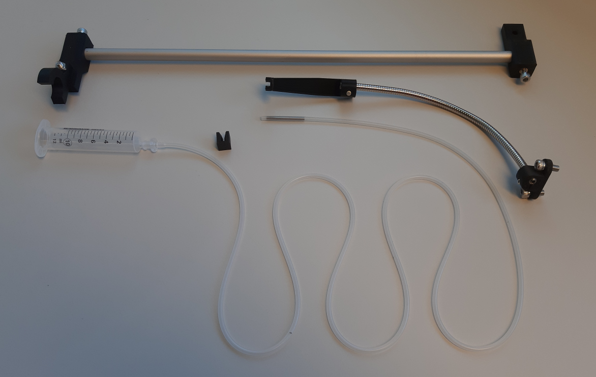
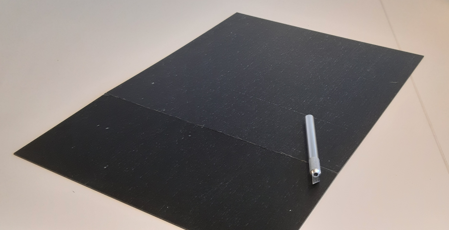

# Building Your Setup

## Building a standard steering behavior setup

This chapter will guide you through assembling an enclosed setup for steering wheel tasks. It contains a display for visual stimuli, a valve-controllable reward spout, and a 120fps camera and light source in an A3 form factor. This setup can function as a basis or example from which to develop setups with alternative stimuli and interaction sensors.

### Base Plate

The base plate can be 3D-printed and fit with threaded inserts to allow for mounting components. Later the baseplate with its mounted components can be screwed onto setup's boxes scaffolding. Additional inserts can be added wherever additional mounting points are required.

### Reward tubing

Reward droplets are going to be delivered through gravity and a silicon tube clamped shut by a valve outside of moments of reward.

The top part can be attached to the top of the setup to hold the reward reservoir. The reservoir is a 10ml syringe tube connected to silicon tubing. A valve or 3D-printed clamping element can be used to clamp the tubing shut. The end can be positioned with a flexible arm to be in reach of your subject. A large blunt syringe tip can be used to provide additional stability to the spout. When using a cut-off blunt needle tip like this make sure to sand and wash the cut edge to prevent metalic splinters.

### Display

You can use insulation tape to cover the backside of the display and attach its driver board. The driver boards/boards may look different depending on your bought version. This should not affect the displays' capability however.

### Scaffold and hull

First assemble the ground plane. The 3 inner floor extrusions and their spring-loaded t-nuts are positioned according to the corresponding screw-hole locations of the floor plates assembled above. Confirm the fit to the floor plates before continuing.

Notably the scaffold contains contains two offset extrusions on the front-facing side. These extrusions will enable sliding in the front panel between them as a simple access door.

With the scaffold assembled you can drop in and secure the experiment setup.

Next you can cover the scaffold with acrylic panels. To cut acrylic sheets into size you can use a precision knife to carve a deep line and then snap the sheet along it.

The panels can be attached to the scaffold with magnetic tape along the aluminium extrusions. This also allows the panels to snap into place at the complementary magnetic tape while also making panels easy to remove when you need easy access to components.

For guiding power and data cables inside, you can cut a small rectangular hole in the backside wall with an oscillation tool saw. 45mm heigh, 25mm wide, 55mm from the wall end should be sufficient.

Notably this setup is not sound-proof. If sound proofing is important for your experiment, insulating foam can be added to the walls. When using an insulated setup make sure that the temperature inside is not rising beyond the comfort of your subject and add ventilation as needed.

With the panels added we have arrived at our ready experiment setup.

The reward reservoir was added to the top. The size an individual reward can be controlled with the height of the reservoir, or the duration of the valve opening.